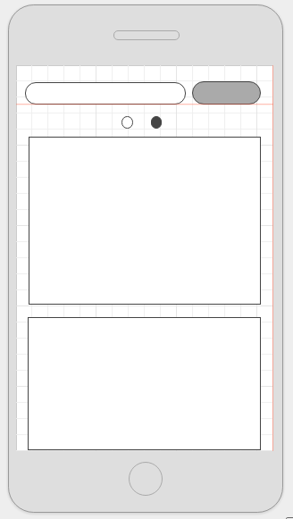
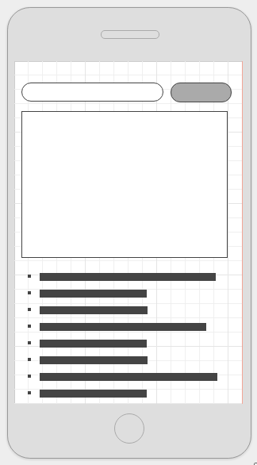

## Cozinha

### Background

Cozinha is a native mobile app for Android, whose purpose is to connect foodies together and celebrate cooking. Users can search up recipes, take pictures of completed recipes, and share pictures to social media.

### Functionality & MVP  

In Cozinha, you will be able to:

- [ ] Display search bar
- [ ] Search for recipes
- [ ] Swipe to switch between recipe view and social view
- [ ] View individual recipe and user post

As well, there will be:
- [ ] A production Readme

## Design Docs
* [View Wireframes](docs/wireframes)

### Architecture and Technologies

This project will be implemented with the following technologies:

- Android/Java
- Android Studio
- Some food/recipe API and Instagram API

The application will include 3 main screens, one with food photos, one 'social' view utilizing instagram API, and a show page which displays information.

### Implementation Timeline

**Day 1 (Monday)**: Setup environment (Android Studio, Java). Initialize project and setup github. Get home page up. Get started with search.

**Day 3 (Wednesday)**: Get API Search to work. Display recipe view. Display show page for individual recipe.

**Day 5 (Friday)**: Get Instagram API to work and display search results for that view. Display show page for individual.

###Group Members & Work Breakdown

Our group consists of three members, Michael Mach, Nicholas Vizzutti, and Kathy Luo.

### Bonus features

If given the time, I would try to implement these features:

- [ ] Create a post
- [ ] Keep track of recipes created
- [ ] Utilize Facebook Auth API to share recipes
