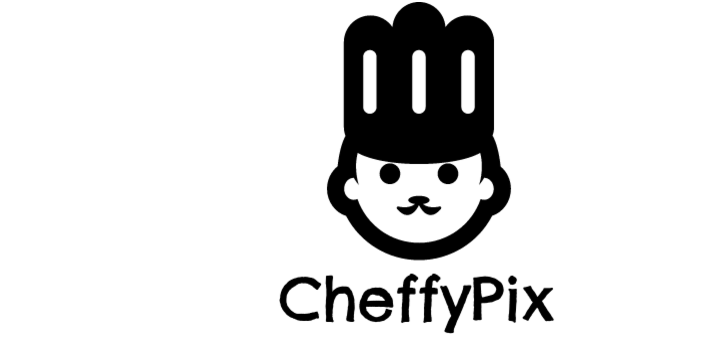

## CheffyPix

### Background

CheffyPix is a native mobile app for Android, whose purpose is to connect foodies together and celebrate cooking. Users can search recipes for their favorite foods, take pictures of their completed recipes, and share pictures and recipes with others.

### Demo

See our demo page [here](link) for an in-depth view of our features.

### Features List

- Start searching for your favorite recipes immediately from the homepage
- View search results as a scrolling list of images to quickly find your recipe
- View recipe page with a full list of ingredients and a link to cooking directions
- Navigate from recipe view to recipe sharing mode with the Share button
- Take pictures of your own creation and send them to your friends and family
- Auto-fill your text, email, or any other compatible sharing app with the recipe and your image

## Install

Find us on the Google Play! CheffyPix is a free android app and can be found [here](add link).

## Architecture and Technologies

This project was implemented in Java using Android Studio. The application uses the Food2Fork API for recipe information and details.

TODO include architecture breakdown

The application code includes inplementations of:

- Asynchronous tasks, implemented by subclassing built-in AsyncTask to reduce the need for manipulating threads or handlers
- API request interaction by building an URI reference with the query and API key appended, and opening the connection using HttpURLConnection methods
- API response interaction by reading the the stream and parsing the JSON response with JSONObject methods and related functionality
- JSONt to Bitmap parser to display images retreived from the API
- Recipe classes to properly encapsulate the recipe information retreived
- Nested views, implemented with ListViews and appropriate adapters to populate the list item

As well the application uses many design customizations, including:
- Custom View class for lists
- Many drawables including an implementation of drop shadows and rounded search bar
- Custom logo and variations created by the team

## Sample Code

In the sample code below, we show an example of asynchornous tasks and encapsulation with classes. AN API call runs in the background, and on completion, the information is retrieved through class methods and mounted to the various views:

TODO put code example of RecipeListView

The code below shows the use of an adaptor to correctly display the list item as designed in the ListItem xml.

TODO put code example from adapter

## Logo Design
Our project name was thought up by Michael Mach. Our logo was designed and drawn by Nicholas Vizzutti. Variations based on the the original design were created by Kathy Luo.

##Team Members

Michael Mach | Nicholas Vizzutti | Kathy Luo
---|---|---
[LinkedIn](https://www.linkedin.com/in/michael-mach-77485791) | [LinkedIn](https://www.linkedin.com/in/nvizzutti)| [LinkedIn](https://www.linkedin.com/in/kathy-luo-24517751)
[GitHub](https://github.com/mike591) | [GitHub](https://github.com/NVizzutti) | [Github](https://github.com/kalu1302)
